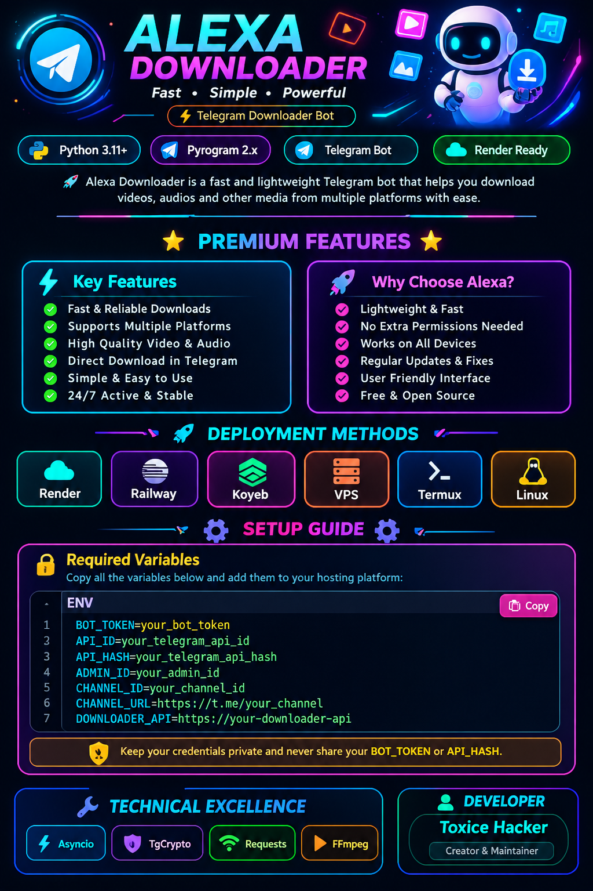

<div align="center">

# ⚡ Alexa Downloader

<p align="center">
  
</p>

<p>
  
  
  
  
</p>

</div>

---

<h2 align="center">
  
</h2>

<div align="center">

| ⚡ Performance | 🤖 Telegram |
|:---:|:---:|
| 🚀 Fast Response | 💬 Telegram Bot Interface |
| 🔥 Lightweight | 📥 Downloader Integration |
| ⚙️ Easy Configuration | 🛡️ Admin Support |
| ☁️ Cloud Ready | 🔗 Channel Integration |

</div>

---

<h2 align="center">
  
</h2>

<div align="center">

**Render** • **Railway** • **Koyeb** • **VPS** • **Termux** • **Linux**

</div>

---

<h2 align="center">
  
</h2>

### 🔐 Required Variables

Copy all variables below and add them to your hosting platform:

```env
BOT_TOKEN=your_bot_token
API_ID=your_telegram_api_id
API_HASH=your_telegram_api_hash
ADMIN_ID=your_admin_id
CHANNEL_ID=your_channel_id
CHANNEL_URL=https://t.me/your_channel
DOWNLOADER_API=https://your-downloader-api
```

> 🔒 Keep your credentials private and never share your `BOT_TOKEN` or `API_HASH`.

---

<h2 align="center">
  
</h2>

<p align="center">
  
  
  
  
  
</p>

---

<h2 align="center">
  
</h2>

```bash
git clone https://github.com/TOXICE765425/Alexa-Downloader.git
cd Alexa-Downloader
pip install -r requirements.txt
python bot.py
```

---

<h2 align="center">
  
</h2>

<p align="center">

### 🔥 Toxice Hacker

</p>

---

<p align="center">
  
</p>

<p align="center">
  
</p>

<p align="center">
  ⭐ <b>Star the repository if you like it!</b> ⭐
</p>

<p align="center">
  
</p>
